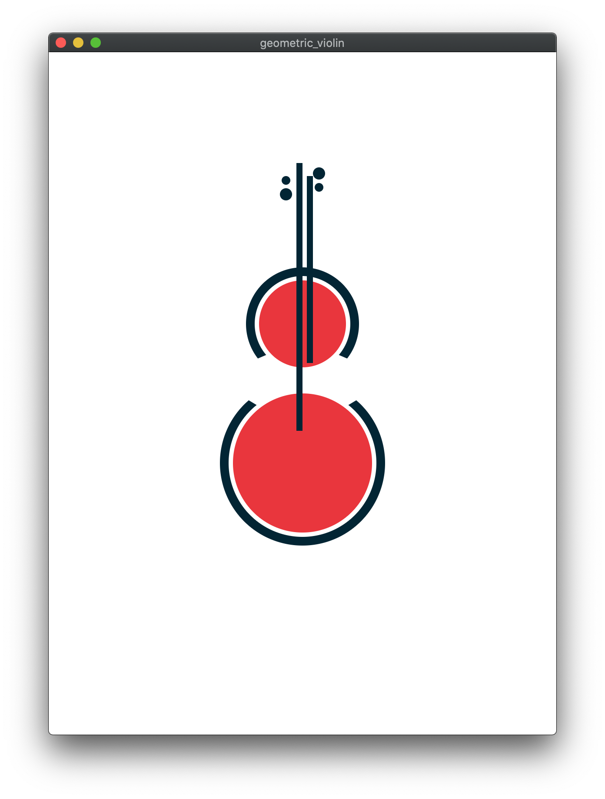
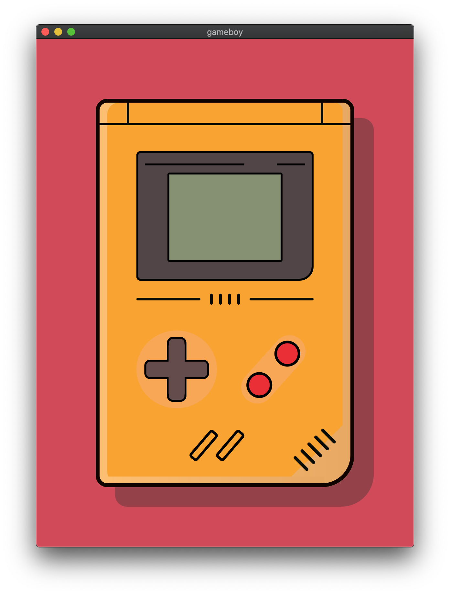
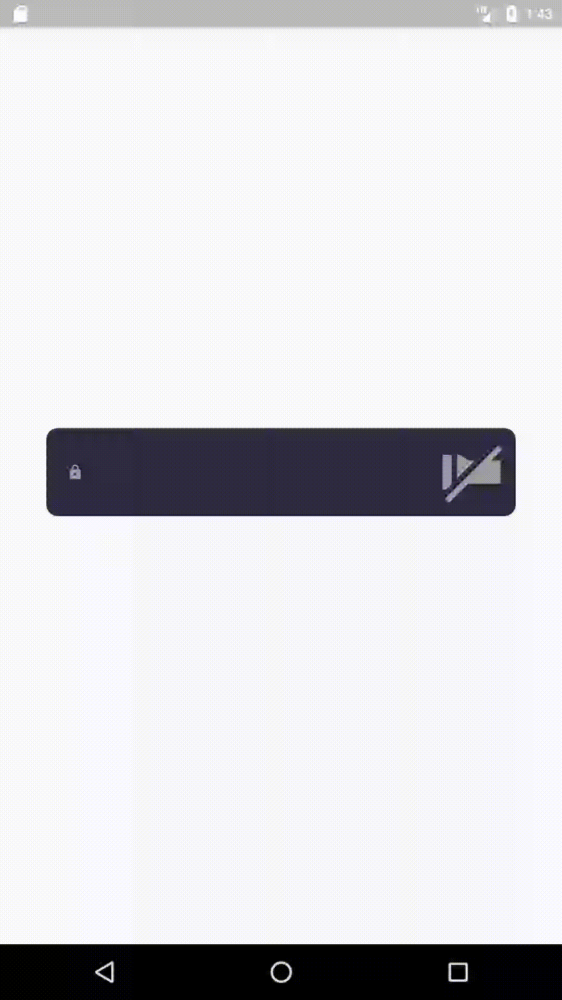

# My Flutter Challenges

This is my **Flutter Challenges** repository, here I leave all the source code 😎

React with a ⭐️ if you find it interesting and explore the challenges 😉

## Challenges

| [Geometric Violin](https://github.com/zaumaiano/my-flutter-challenges/blob/main/geometric_violin/lib/app.dart) | [GameBoy Illustration](https://github.com/zaumaiano/my-flutter-challenges/blob/main/gameboy/lib/app.dart) |
|:-:|:-:|
||

| [Flashlight Password](https://github.com/zaumaiano/my-flutter-challenges/blob/main/flashlight_password/lib/app.dart) | [Magic Reading](https://github.com/zaumaiano/my-flutter-challenges/blob/main/magic_reading/lib/app.dart) | [Light Messages](https://github.com/zaumaiano/my-flutter-challenges/blob/main/light_messages/lib/app.dart) |
|:-:|:-:|:-:|
||||

| [Macindows](https://github.com/zaumaiano/my-flutter-challenges/blob/main/macindows/lib/app.dart) |
|:-:|
||

## Getting Started

This project is a starting point for a Flutter application.

A few resources to get you started if this is your first Flutter project:

- [Lab: Write your first Flutter app](https://flutter.io/docs/get-started/codelab)
- [Cookbook: Useful Flutter samples](https://flutter.io/docs/cookbook)

For help getting started with Flutter, view our 
[online documentation](https://flutter.io/docs), which offers tutorials, 
samples, guidance on mobile development, and a full API reference.
